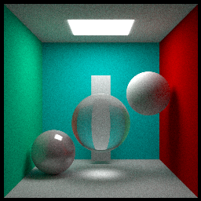

# Results

## Shadow
You can drag the left mouse button to rotate the camera,   
and hold down Ctrl or Shift key while dragging the left mouse button to move the scenes.  

### ShadowMapping

### Percentage Closer Filering

### Percentage Closer Soft Shadow
  

## Environment Mapping

### Precomputed Radiance Transfer

### Imaged Based Lighting(diffuse)

### Imaged Based Lighting(specular)

## Global Illumination

### Screen Space Ambient Occlusion 
You can move camera by `w`,`s`,`a`,`d`,
and drag the left mouse button to rotate the camera.

### Screen Space Reflections
  
  

### Reflective Shadow Maps 
  

## Physically Based Rendering

### Cook-Torrance BRDF PBR

### LTC Area Light Source

### Non Photorealistic Rendering
#### Toon
  
#### Gooch
  
#### Sobel
  
#### Hatching
  

## Ray Tracing
### Path Tracing
  
#### KVH 
  

# External Dependencies
Assimp  
glfw  
glad  
glm  
imgui  
nori  
stb_image

# Run
After making sure all dependencies are downloaded, start `Build External Dependencies`task to process them.  
Start `Build Rendering`task to compile the all project.  
Please refer to the `task.json` file for detailed configuration.

---
# References
[GAMES202-Real-Time High Quality Rendering](https://sites.cs.ucsb.edu/~lingqi/teaching/games202.html)  
[花桑's GAMES202 Assignment](https://www.zhihu.com/column/c_1591546501603545090)  
[WC Yang's Real-Time High Quality Rendering](https://yangwc.com/)   
[KillerAery's Real-time Global Illumination](https://www.cnblogs.com/KillerAery/collections/3076)  
[LearnOpenGL](https://learnopengl.com/)  
[AKG4e3's Ray Tracing Tutorial-EzRT](https://github.com/AKGWSB/EzRT?tab=readme-ov-file#part-3-opengl-ray-tracing)  
